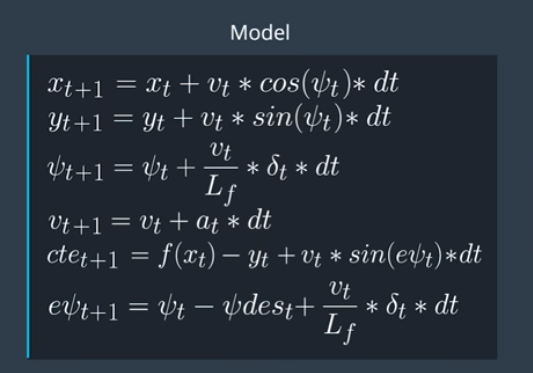

# CarND-Controls-MPC
Self-Driving Car Engineer Nanodegree Program

---
The goal of this project is to drive a car in a simulator using the Model Predictive Controller(MPC). The MPC is used to control the steering angle and the throttle, so that the car in the simulator stays inside the road for an entire lap. The instructions to build this project is [here](Project_Setup.md).

## Implementation
### 1. The Model
The model for this project used is the kinematic model. This model incorporates the car's x and y coordinates, the orientation of the car - psi, the velocity of the car - v, the cross track error - cte and the error in orientation - epsi. The actuator inputs are the steering angle (delta) and the throttle (a). The following equations represent the kinematics model used:

### 2. Timestep Length and Elapsed Duration (N & dt)
The product of N and dt provides the time over which the prediction calculation is to be done. I started with a N value of 20 and dt value of 0.5. This resulted in slow processing of the control. Thus, I decided to decrease the value of N. I tried values 15 and 10. I also varied my dt to values 0.4, 0.2 and 0.1. I got a better performance at N = 10 and dt = 0.2. While the other values provided erronous results, with the car often driving out of the track, N = 10 and dt = 0.2 provided stable driving of the car.

### 3. Polynomial Fitting and MPC Preprocessing
The x, y coordinates of the car, orientation of the car and velocity are transformed to account for latency. They are then transformed into the car's coordinate system. These transformed points are used to fit a polynomial which is the reference trajectory that the car has to follow. A third degree polynomial is used to fit the line here. The `polyeval` function is used to find the cross track error and the arctan of the differential of the polynomial reference trajectory is used to calculate the error in orientation. The x,y and psi for the car in the car's coordinate system are 0's, since the car is located in the origin with 0 orientation in the car's coordinate system. These values are now passed to the `MPC::Solve` function.

### 4. Model Predictive Control with Latency
In real world, actuators are often applied with a latency in the car. In the simulator, a latency of 100 ms is used. Inorder to adjust for this, the x, y coordinates of the car, orientation of the car and velocity are used to predict the state of the car after 100ms. This state is used to find the actuator values by the MPC. Thus, when these values are applied, the car would have approached the predicted state and the actuators could be applied correctly.
